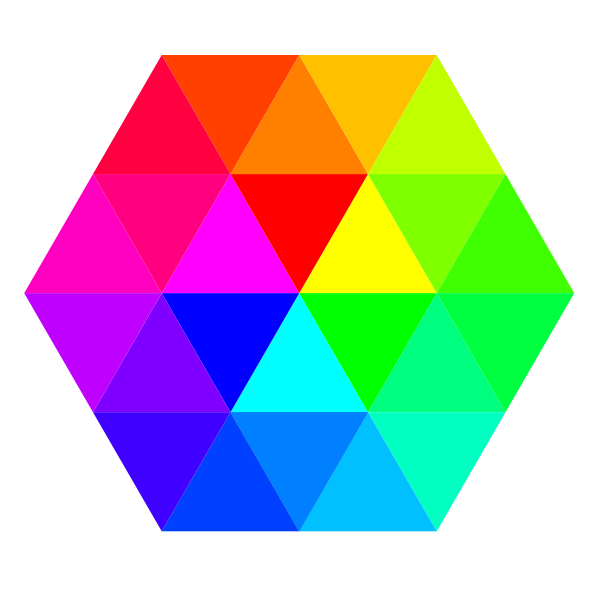

<p align="center">
   
</p>

# ColorGen

A script for generating attractive random colors.

To use colourGen in a web browser, include colourGen.js on your page. The generate a colour:

```javascript
var color = colourGen(); // returns a random nice hex colour code
```

To use colourGen with node JS:

```bash
npm i -g
npm link
```
```javascript
var colourGen = require('colourGen'); // import
var color = colourGen(); //returns a random nice hex colour code
```

## Options

An options object to influence the type of colour can be passed. 

It has the following properties:

- hue – The hue of the generated colour. You can pass a string representing a color name: ```red```, ```orange```, ```yellow```, ```green```, ```blue```, ```purple```, ```pink``` and ```monochrome```. If you pass a  hexi colour string such as ```#00FFFF```, colourGen will get its hue value.

- luminosity –  the luminosity of the generated colour. A string of either ```bright```, ```light``` or ```dark```.

- ```count``` – The number of colours to generate.

- ```initial``` -Integer or string which will causes colourGen to return the same colour every time.

- ```format``` – A string, specifies the format of the generated colour from ```rgb```, ```rgba```, ```rgbArray```, ```hsl```, ```hsla```, ```hslArray``` and ```hex``` (default).

- ```alpha``` – A decimal between 0 and 1. Only needed when using  an alpha channel (```rgba``` and ```hsla```). Defaults to a random value.

## Examples

```javascript

// Returns a hex code for an attractive color
colourGen(); 

// Returns an array of five blue colors
colourGen({
   count: 5,
   hue: 'blue'
});

// Returns a hex code for a light red
colourGen({
   luminosity: 'light',
   hue: 'red'
});

// Returns a hex code for a  "random" colour
colourGen({
   luminosity: 'random',
   hue: 'random'
});

// Returns a bright colour with RGB
colourGen({
   luminosity: 'bright',
   format: 'rgb'
});

// Returns a dark GB colour with a random alpha
colourGen({
   luminosity: 'dark',
   format: 'rgba'
});

// Returns a dark RGB colour with specified alpha
colourGen({
   luminosity: 'dark',
   format: 'rgba',
   alpha: 0.8,
});

// Returns a light HSL colour with a random alpha
colourGen({
   luminosity: 'light',
   format: 'hsla'
});

```
